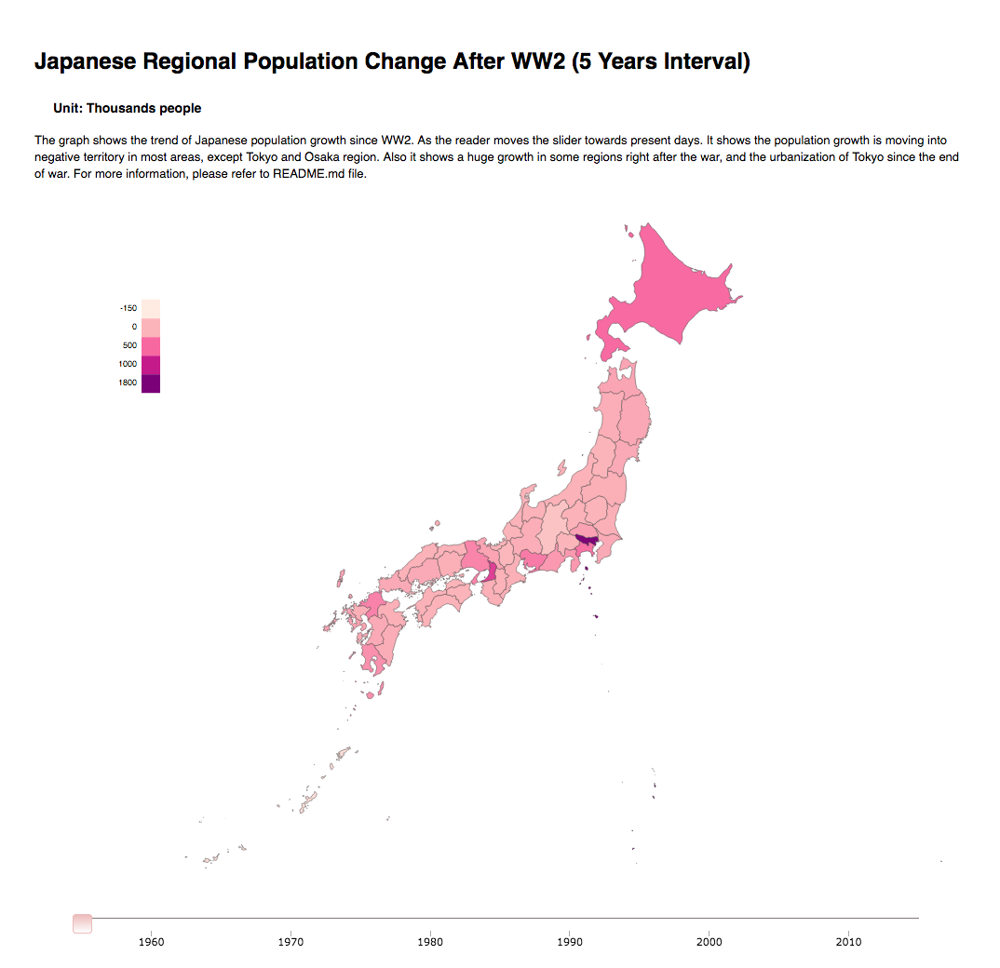

# D3 Project - Japan Population Trend Since WW2 #

### Summary ###

The graph shows the trend of Japanese population growth since WW2. As the reader moves the slider towards present days. It shows a huge growth in some regions right after the war, and the urbanization of Tokyo since the end of war. The overall trend of population is in negative growth, which reflects Japan's aging population issue. 

### Design ###

The initial design was based on the original data which reflects the overall population of each region since WW2. But due to the gap between Tokyo and rest of the regions is way too high, therefore the graph/color can not reflects the growth/decline. With the modification of data, which shows the population change in 5 year interval instead. Now he trend is easier to spot with this data arrangement. 

### Note ###

I've considered using log10(data) to have a better data representation and trend spotting. But it may causes confusion for readers without certain mathematic knowledge.

### Feedback ###

After initial graph, I presented it to some friends and collected their feedbacks. Here's some suggestion:
1. Color palate is confusing, unable to clearly understand what each color represents. 
**Solution**: Changed color palate.
2. The choice of year was placed in text form. 
**Solution**: Changed to slider form.
3. Lack of border between each region can be confusing, especially when the color is the same.
**Solution**: Added border

### Resource ###

Many thanks to StackOverflow community for answering my questions on this project.

* Gary Pang: Japan GeoJson file and D3.js map - http://www.gary-pang.com/web-design/2014/11/05/d3-js-geojson-map-japan/

* Adam Moore: Japan GeoJson map - http://bl.ocks.org/minikomi/4043986

* Katsumi Takano: Japan Map [TopoJSON] - http://bl.ocks.org/hunzy/9525160/5702d354f7dc87c95a662bd48c7505f36f795e2c

* Sugimoto Tatsuo: Japan Prefectures Map - https://bl.ocks.org/sugi2000/560f664f9b32a17b2c4e

* Sugimoto Tatsuo: Japan Municipal Map - https://bl.ocks.org/sugi2000/0042c13281f3cc9ebcaf83aa6a2388ac/

* ColorBrewer2: Color Choice for Map - http://colorbrewer2.org/#type=sequential&scheme=Reds&n=5

* Japan Statistical Yearbook (Original Data) - http://www.stat.go.jp/english/data/nenkan/1431-02.html

* John Walley: d3-simple-slider - https://bl.ocks.org/johnwalley/e1d256b81e51da68f7feb632a53c3518

* D3.js Slider Examples - http://thematicmapping.org/playground/d3/d3.slider/

* Andy Woodruff: Mapping with D3 - https://maptimeboston.github.io/d3-maptime/#/2/1

* Scott Murray: Interactive Data Visualization for the Web - http://alignedleft.com/tutorials/d3

* Mike Bostock: D3 graph samples - https://bl.ocks.org/mbostock

* Interactive Map with d3.js - http://www.tnoda.com/blog/2013-12-07

* Mike Bostock: Let's Make a Map - https://bost.ocks.org/mike/map/

* Simple d3.js Tooltips - http://bl.ocks.org/d3noob/a22c42db65eb00d4e369

### Visualization ###

[Data Visualization](https://bl.ocks.org/yudataguy/2910dbc93860fd853a524c605e3d2baa)

[Local files](d3_jp.zip) - If online display is not working, please download the file and display in local http environment.

